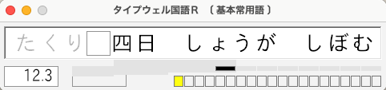
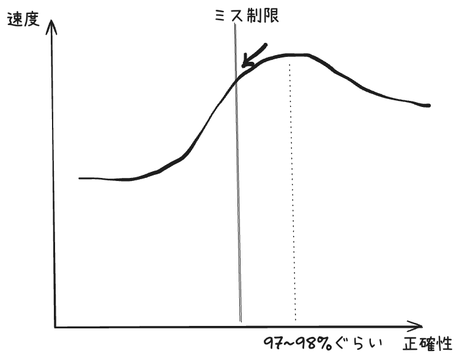
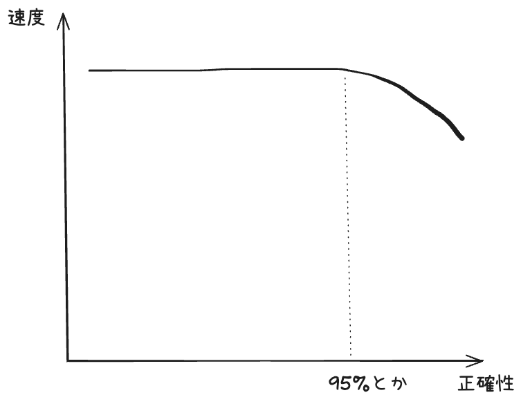

# 2025-09-09

今日の予定

- 先週の練習の振り返り
  - 新しく取り入れたこと
  - 記録更新しました
  - ミス制限について思っていること
- 練習します

---

# 先週の練習の振り返り

- 新しく取り入れたこと
  - コンパクトモード（F2）を採用した
  - ミス制限12（3%）、目標XAを設定して練習している
- 自己ベストを32.687→32.204に更新した

---

# コンパクトモードについて

↓コンパクトモード

- 英単語で使ったことがあり、ローマ字にもあったので使ってみたら好感触
- 情報量が減って集中でき、平均タイムも向上。
- デメリット
  - ローマ字読みができない（初速のためや、漢ことでローマ字読みしたい場合は使えない）
  - TWJRでは、ラップタイムや現在位置が分からない

---

# ミス制限と目標設定について

- テルさんdqmaniacさんの記事を呼んで、両者ともミス制限練習を採用されていた
- 何のために？
  - テルさん: 安定的に打てる速度を上げる意識で常に練習を行っている
  - dqmaniacさん: 実用入力のことも考えて。"速度と正確性は同時に伸ばすべき"

→ミス制限は速度を上げるためのものでもあると思った

---

# ミス制限は速度を上げるため？

- 精度が下がりすぎると速度も出なくなるから
- プレイスタイルによって変わるが、「もっともKPMが出やすい精度」がある
  - 僕の場合はエタイの体感で97~98%ぐらい
- ミス制限に引っかかるようになったら、引っかからないように打つ。そうすれば速度も上がる。

---

# ミス制限は速度を上げるため？

- 良いプレイを保つための防波堤のようなイメージ

j
---

# 余談

- 正確性と速度があまり関係なく、正確性を意識すると速度が落ちてしまう場合はミス制限つけなくても良さそう

